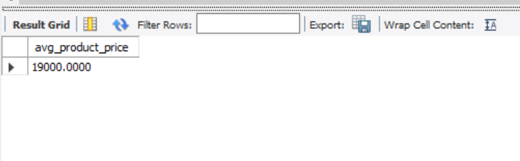
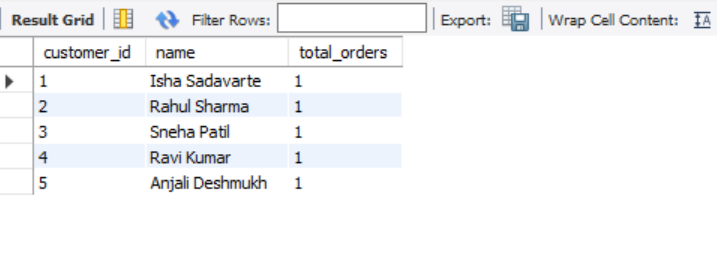
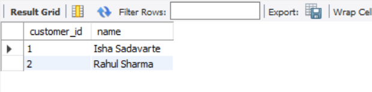
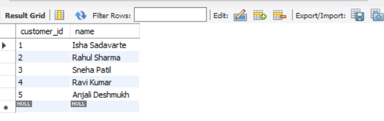
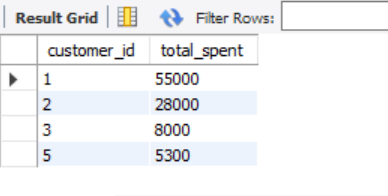
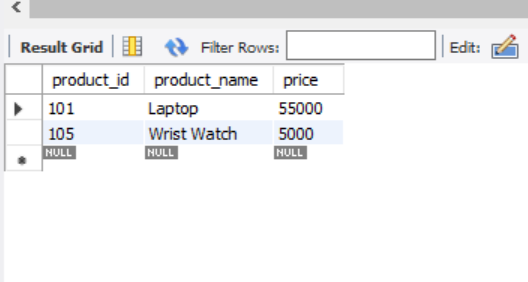

# Task 6 – Subqueries & Nested Queries in SQL

## 📌 Overview
This task demonstrates **different types of subqueries and nested queries** using an `EcommerceDB` schema.

We have four tables:
- **Customer**: Stores customer details
- **Products**: Stores product details
- **Orders**: Stores order records with total amount
- **Order_Items**: Stores individual products in each order

---

## 🗂️ Files in this Task
- `Task6_Schema.sql` → Database schema (tables creation)  
- `Task6_Insert.sql` → Insert sample data  
- `Task6_Queries.sql` → Subquery examples  
- `screenshots/` → Contains screenshots of query execution results  

---

## ⚡ Steps to Run

1. Open **MySQL Workbench / DB Browser for SQLite**  
2. Run `Task6_Schema.sql` → Creates tables  
3. Run `Task6_Insert.sql` → Inserts sample data  
4. Run `Task6_Queries.sql` → Executes subqueries  

---

## 🔍 Queries Included

1. **Scalar Subquery** – Average product price  
   

2. **Correlated Subquery** – Orders per customer  
   

3. **Subquery with IN** – Customers who bought Electronics  
   

4. **Subquery with EXISTS** – Customers with orders > 1000  
   

5. **Derived Table in FROM** – Top customers by spend  
   

6. **Subquery comparing product price with category average**  
   

---

## ✅ Expected Outputs

- Average product price value  
- List of customers with order counts  
- Customers who purchased electronics  
- Customers with total spend > 5000  
- Products priced above their category average  

---

